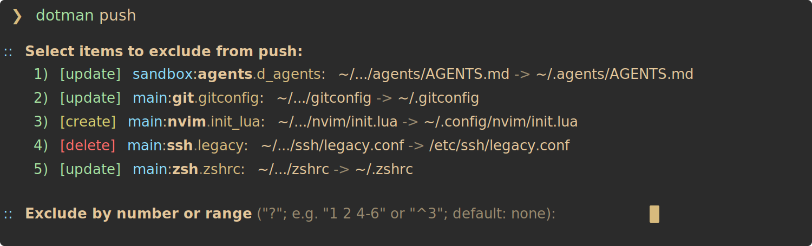

# dotman

Package-oriented dotfile manager with planning, diff review, and two-way sync.

## Inspiration

`dotman` is inspired by tools like [`pacman`](https://wiki.archlinux.org/title/Pacman) and [`yay`](https://github.com/jguer/yay), especially in its CLI ergonomics, selection flows, and review-oriented workflow.

## Why

Modern development workflows are encoded in dotfiles, editor state, helper scripts, and selected system configuration.

`dotman` is for deploying that workflow reproducibly across machines by treating it as a packageable, reviewable, and synchronizable configuration graph.

## Design philosophy

Intuition over configuration.

First principles over convention.

## Platform support

`dotman` follows XDG-style paths and POSIX-like filesystem and process conventions.

It is currently intended for POSIX-like systems and is not designed for native Windows support.

## Install

### Required

- `uv` for installation
- `git` for diff review

### Install command

```sh
uv tool install git+https://github.com/ewgdg/dotman.git
```

### Optional dependencies

- `fzf` for long interactive selector lists
- `nvim` for review and reconciliation flows; set `VISUAL=nvim` or `EDITOR=nvim` to use it

## Quick start

The install command above installs the CLI. Clone the repo separately if you want to use the bundled example repo under `examples/repo/`:

```sh
git clone https://github.com/ewgdg/dotman.git ~/projects/dotman
mkdir -p ~/.config/dotman
cat > ~/.config/dotman/config.toml <<'EOF'
[repos.example]
path = "~/projects/dotman/examples/repo"
order = 10
EOF
```

Track and push one simple package from the example repo. This writes the example note to `~/.config/dotman-example/note.txt`:

```sh
dotman track example:note@basic
dotman push --dry-run
dotman push
```

For a larger real-world example repo, see [ewgdg/dotfiles](https://github.com/ewgdg/dotfiles).

## Documentation

- CLI behavior: [`docs/cli.md`](docs/cli.md)
- User config: [`docs/config.md`](docs/config.md)
- Repository layout: [`docs/repository.md`](docs/repository.md)

## Features

### Modular package system

Group dotfiles and system files into reusable packages.

### Tracked packages with `track` and `untrack`

Persist or remove tracked packages so repeated `push` and `pull` runs can reuse the same selections.

Example:

```sh
dotman track example:git@basic
dotman untrack example:git@basic
```

### Package manifest scaffolding with `add`

Use `add` to propose or extend package target definitions from live paths.

Example:

```sh
dotman add ~/.gitconfig example:git
```

### Two-way sync

- `push` applies managed changes from the repo to the live system
- `pull` updates the repo from the live system

Example:

```sh
dotman push
dotman pull
```

### Interactive selection and review workflow

Support partial selector matching, interactive disambiguation, combined selection flows, and diff review before execution, with a workflow inspired by `yay` for a more familiar terminal experience.



### Snapshots and rollback

Create snapshots before real `push` runs and restore managed paths with `rollback`.

Example:

```sh
dotman rollback latest
```

### Flexible template support

Support custom render and capture functions per target.

### Reconcile editor

Support editor-backed reconciliation during pull flows.

### First-class system files support

Manage not only user dotfiles, but also system files when run with appropriate permissions.

