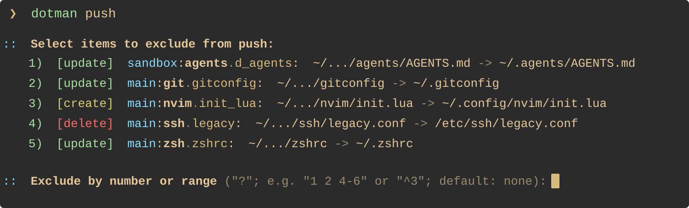

# dotman

Package-oriented dotfile manager with reviewable two-way sync.



## Why

Modern development workflows are encoded in dotfiles, editor state, helper scripts, and selected system configuration.

`dotman` is for deploying that workflow reproducibly across machines by treating it as a packageable, reviewable, and synchronizable configuration graph.

## Design philosophy

Intuition over configuration.

First principles over convention.

Declarative over imperative.

## Platform support

`dotman` follows XDG-style paths and UNIX-like filesystem and process conventions.
It is currently intended for UNIX-like systems.

## Install

### Required

- `uv` for installation
- `git` for diff review

### Install command

```sh
uv tool install git+https://github.com/ewgdg/dotman.git
```

`dotman --version` shows the installed build: a release tag such as `0.10.1`, or a
development build past it such as `0.10.2.dev3+g1a2b3c4`. The version is fixed at
install time, so reinstall to refresh it.

### Diagnose setup

```sh
dotman doctor
```

This checks manager config, repo paths, tracked package state files, and external dependencies such as `git`.

## Quick start

The install command above installs the CLI. Clone the repo separately if you want to use the bundled example repo under `examples/repo/`:

```sh
git clone https://github.com/ewgdg/dotman.git ~/projects/dotman
mkdir -p ~/.config/dotman
cat > ~/.config/dotman/config.toml <<'EOF'
[repos.example]
path = "~/projects/dotman/examples/repo"
order = 10
EOF
```

Track and push one simple package from the example repo. This writes the example note to `~/.config/dotman-example/note.txt`:

```sh
dotman track example:note@basic
dotman push --dry-run
dotman push
```

Edit the live note, then let `sync` bring the change back into the repo:

```sh
echo "edited on this machine" >> ~/.config/dotman-example/note.txt
dotman sync example:note
```

For a larger real-world example repo, see [ewgdg/dotfiles](https://github.com/ewgdg/dotfiles).

## Documentation

- Sync lifecycle and Bases: [`docs/sync.md`](docs/sync.md)
- CLI behavior: [`docs/cli.md`](docs/cli.md)
- User config: [`docs/config.md`](docs/config.md)
- Contributor architecture: [`docs/code-structure.md`](docs/code-structure.md)
- Domain vocabulary: [`CONTEXT.md`](CONTEXT.md)
- Repository configuration: [`docs/repository.md`](docs/repository.md)
- Template targets: [`docs/templates.md`](docs/templates.md)
- Agent skill indexing these docs, plus noise-filtering guidance: [`skills/dotman`](skills/dotman/SKILL.md), installable with `npx skills add ewgdg/dotman -g`

## Features

### Modular package system

Group dotfiles and system files into reusable packages.

### Tracked packages with `track` and `untrack`

Persist or remove tracked packages so repeated `push` and `pull` runs can reuse the same selections.

Example:

```sh
dotman track example:git@basic
dotman untrack example:git@basic
```

### Package scaffolding and authoring

Use `add` to propose or extend package target definitions from live paths.
Use `edit` to open repo-side package sources, target sources, per-repo local overrides, or the dotman manager config in your editor.

Example:

```sh
dotman add ~/.gitconfig example:git
dotman edit repo example
dotman edit package example:git
dotman edit target example:git.gitconfig
dotman edit local example
dotman edit config
```

### Two-way sync

`sync` compares every tracked target between the repo and the live system, then lets you settle each difference on one review screen, the Command Deck.

- **Per-target choice**: Use repository, Use live, or Merge.
- **Three-way merge**: dotman keeps a Sync Base, the last state both sides agreed on, so Merge knows which side changed.
- **Frozen review**: dotman observes once; what you review is exactly what gets written.
- **Nothing written until you confirm**: open any row for its diff, edit the outcome, then confirm.
- **Scriptable**: `--dry-run`, `--json`, and `--unattended` for previews and automation.

`push` (repo → live) and `pull` (live → repo) remain as one-way shortcuts on the same Command Deck.

Example:

```sh
dotman sync
dotman sync example:note
dotman --json --unattended sync --dry-run
```

### Interactive selection and review

Partial selectors resolve to canonical targets, with a menu when input is ambiguous. Every change is reviewed as a diff before it runs.

### Snapshots and restore

Mutation-bearing real `push` runs may create snapshots; restore managed paths with `restore`.

Example:

```sh
dotman restore latest
```

### Flexible template support

Support custom render and capture functions per target.

### Reconcile editor

Support editor-backed reconciliation during pull flows.

### First-class system files support

Manage user dotfiles and system files alike; dotman escalates privileges automatically when needed.
