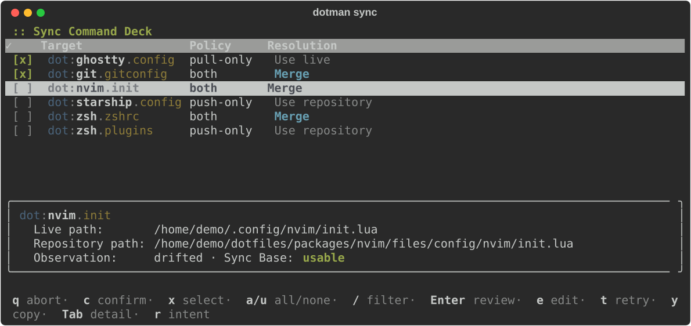

# dotman

Package-oriented dotfile manager: reproducible across machines, with reviewable two-way sync.



- **Two-way sync with merge**: settle drift between your repo and your machine file by file, with a three-way merge
- **Review before write**: every change is a diff you approve
- **Packages, not loose files**: profiles, templates, and dependencies
- **System files too**: escalates privileges only when needed

## Design philosophy

```text
workflow = reconcile(derive(intent), host)
```

- **intent**: packages, profiles, and variables in your repo
- **derive**: resolve packages and render templates into concrete files
- **host**: the live machine
- **reconcile**: `sync` — push, pull, or merge each difference

## Install

Needs `uv` and `git`, on a UNIX-like system (dotman follows XDG paths).

```sh
uv tool install git+https://github.com/ewgdg/dotman.git
dotman doctor   # check config, repo paths, and dependencies
```

## Quick start

Clone the repo to try the bundled example under `examples/repo/`:

```sh
git clone https://github.com/ewgdg/dotman.git ~/projects/dotman
mkdir -p ~/.config/dotman
cat > ~/.config/dotman/config.toml <<'EOF'
[repos.example]
path = "~/projects/dotman/examples/repo"
order = 10
EOF
```

Track and push one simple package. This writes the example note to `~/.config/dotman-example/note.txt`:

```sh
dotman track example:note@basic
dotman push --dry-run
dotman push
```

Edit the live note, then let `sync` bring the change back into the repo:

```sh
echo "edited on this machine" >> ~/.config/dotman-example/note.txt
dotman sync example:note
```

For a larger real-world example repo, see [ewgdg/dotfiles](https://github.com/ewgdg/dotfiles).

## Features

### Two-way sync

`sync` compares every tracked target between the repo and the live system, then lets you settle each difference on one review screen.


- **Per-target choice**: Use repository, Use live, or Merge.
- **Three-way merge**: dotman remembers the last state both sides agreed on, so Merge knows which side changed.
- **What you review is what gets written**: dotman reads everything once, up front.
- **Nothing written until you confirm**: open any row for its diff, edit the outcome, then confirm.
- **Scriptable**: `--dry-run`, `--json`, and `--unattended` for previews and automation.

`push` (repo → live) and `pull` (live → repo) remain as one-way shortcuts on the same screen.

```sh
dotman sync
dotman sync example:note
dotman --json --unattended sync --dry-run
```

### More

- **Packages**: group dotfiles and system files into reusable packages with dependencies and profiles.
- **Tracking**: `dotman track` / `untrack` remember what this machine manages, so `sync`, `push`, and `pull` need no arguments.
- **Authoring**: `dotman add ~/.gitconfig example:git` drafts a package target from a live file; `dotman edit` opens package, target, or config sources in your editor.
- **Templates**: render and capture files per target, for example Jinja with patch capture.
- **Snapshots**: live files are snapshotted before dotman overwrites them; roll back with `dotman restore latest`.
- **Short names**: type part of a name and dotman finds it, asking only when it is ambiguous.

## Documentation

User guides:

- Sync lifecycle and Sync Bases: [`docs/sync.md`](docs/sync.md)
- CLI reference: [`docs/cli.md`](docs/cli.md)
- User config: [`docs/config.md`](docs/config.md)
- Repository configuration: [`docs/repository.md`](docs/repository.md)
- Template targets: [`docs/templates.md`](docs/templates.md)

Contributors:

- Architecture: [`docs/code-structure.md`](docs/code-structure.md)
- Domain vocabulary: [`GLOSSARY.md`](GLOSSARY.md)

Agents: install the [`dotman` skill](skills/dotman/SKILL.md) with `npx skills add ewgdg/dotman -g`.
